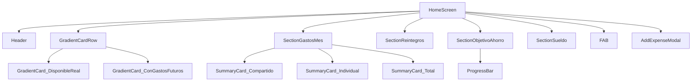
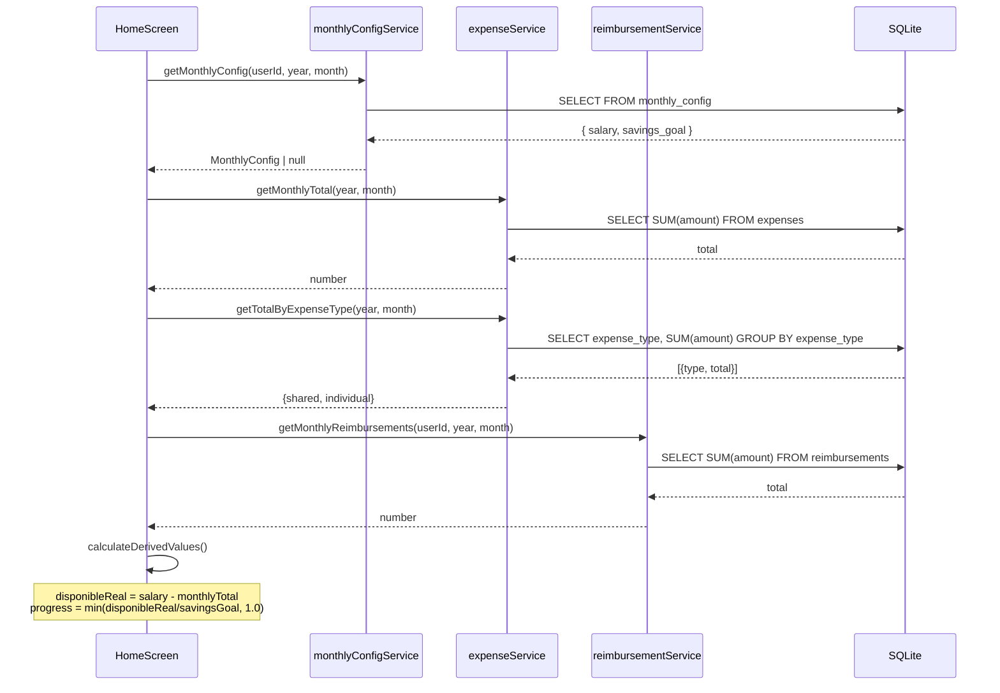

# Documento de Diseño Técnico: Dark Theme Redesign

## Overview

Este documento describe el diseño técnico para el rediseño visual de "Gastos App" adoptando un tema oscuro tipo dashboard financiero. La migración se estructura en **dos fases**:

- **Fase 1**: Migración visual completa (tema oscuro, nuevos componentes, layout rediseñado) usando datos existentes con placeholders para las nuevas entidades.
- **Fase 2**: Incorporación incremental de nuevos conceptos de datos (sueldo, reintegros, tipo de gasto, objetivo de ahorro).

El diseño prioriza la no-destructividad: todos los datos existentes se preservan, y las nuevas columnas/tablas se agregan de forma aditiva.

---

## Architecture

### Estructura de capas

```
┌─────────────────────────────────────────────────────┐
│                   UI Layer                          │
│  HomeScreen  │  ExpensesListScreen  │  Modals       │
├─────────────────────────────────────────────────────┤
│               Component Library                     │
│  GradientCard │ SummaryCard │ ProgressBar │ Theme   │
├─────────────────────────────────────────────────────┤
│               Service Layer                         │
│  expenseService │ monthlyConfigService │            │
│  reimbursementService │ MigrationService            │
├─────────────────────────────────────────────────────┤
│               Data Layer                            │
│  SQLite (native) │ AsyncStorage (web)               │
└─────────────────────────────────────────────────────┘
```

### Diagrama de componentes (HomeScreen)



### Flujo de datos



---

## Components and Interfaces

### 1. Theme (`theme/darkTheme.ts`)

```typescript
export const DarkTheme = {
  colors: {
    bgPrimary: '#0F172A',
    bgCard: '#1E293B',
    bgCardSecondary: '#0F172A',
    textPrimary: '#F8FAFC',
    textSecondary: '#94A3B8',
    accentGreen: '#10B981',
    accentYellow: '#F59E0B',
    border: '#334155',
    errorText: '#FCA5A5',
    deleteButtonBg: '#7F1D1D',
  },
  gradients: {
    disponibleReal: ['#7C3AED', '#EC4899'] as [string, string],
    conGastosFuturos: ['#1D4ED8', '#06B6D4'] as [string, string],
  },
  fontWeights: {
    regular: '400' as const,
    semibold: '600' as const,
    bold: '700' as const,
  },
} as const;

export type DarkThemeType = typeof DarkTheme;
```

### 2. GradientCard (`components/GradientCard.tsx`)

Requiere instalar `expo-linear-gradient`:
```bash
npx expo install expo-linear-gradient
```

```typescript
interface GradientCardProps {
  colors: [string, string];
  label: string;
  amount: number;
  subtitle?: string;           // "de $150.000" o "Configurar sueldo"
  isNegative?: boolean;        // true → monto en #FCA5A5
  style?: ViewStyle;
}
```

Renderiza un `LinearGradient` con `borderRadius: 20`, `padding: 20`, mostrando label arriba y monto grande abajo. El monto usa `toLocaleString('es-AR')` con prefijo `$`.

### 3. SummaryCard (`components/SummaryCard.tsx`)

```typescript
interface SummaryCardProps {
  label: string;
  amount: number;
  percentage?: number;         // 0–100, undefined = no mostrar
  percentageLabel?: string;    // "del sueldo", "del total"
  accentColor?: string;        // default: DarkTheme.colors.textPrimary
  placeholder?: string;        // texto cuando no hay datos: "(próximamente)"
  style?: ViewStyle;
}
```

Tarjeta oscura (`bgCard: #1E293B`) con label pequeño arriba, monto grande en el centro y porcentaje en texto secundario abajo.

### 4. ProgressBar (`components/ProgressBar.tsx`)

```typescript
interface ProgressBarProps {
  progress: number;            // 0.0 – 1.0
  fillColor?: string;          // default: #F59E0B
  backgroundColor?: string;    // default: #334155
  height?: number;             // default: 8
  style?: ViewStyle;
}
```

Implementación con `View` anidados: contenedor con `backgroundColor` y `borderRadius`, hijo con `width: ${progress * 100}%` y `backgroundColor: fillColor`.

### 5. HomeScreen rediseñada

Secciones en orden vertical:
1. **Header**: "Mis Finanzas" + mes/año + botón logout discreto
2. **GradientCard row**: dos tarjetas en `flexDirection: 'row'` con `gap: 12`
3. **Gastos del Mes**: título + tres `SummaryCard` en fila
4. **Reintegros**: `SummaryCard` con acento verde
5. **Objetivo de Ahorro**: `ProgressBar` o botón "Configurar objetivo"
6. **Sueldo del mes**: monto + total con reintegros o botón "Configurar sueldo"
7. **Categorías**: lista existente adaptada al tema oscuro
8. **FAB**: botón flotante verde, sin cambios funcionales

### 6. ExpensesListScreen rediseñada

Cambios visuales únicamente (sin cambios funcionales):
- `backgroundColor: '#0F172A'` en contenedor raíz
- Tarjetas de gasto con `backgroundColor: '#1E293B'`
- Textos con colores del `DarkTheme`
- Botón eliminar: `backgroundColor: '#7F1D1D'`, texto `#FCA5A5`
- Modales: `backgroundColor: '#1E293B'`, `borderColor: '#334155'`

---

## Data Models

### Tabla `expenses` (modificada, no destructiva)

```sql
ALTER TABLE expenses ADD COLUMN IF NOT EXISTS expense_type TEXT DEFAULT 'individual';
-- Valores válidos: 'compartido' | 'individual'
```

### Tabla `monthly_config` (nueva)

```sql
CREATE TABLE IF NOT EXISTS monthly_config (
  id          INTEGER PRIMARY KEY AUTOINCREMENT,
  user_id     INTEGER NOT NULL,
  year        INTEGER NOT NULL,
  month       INTEGER NOT NULL,
  salary      REAL,
  savings_goal REAL,
  created_at  TEXT DEFAULT CURRENT_TIMESTAMP,
  UNIQUE(user_id, year, month),
  FOREIGN KEY (user_id) REFERENCES users(id)
);
```

### Tabla `reimbursements` (nueva)

```sql
CREATE TABLE IF NOT EXISTS reimbursements (
  id          INTEGER PRIMARY KEY AUTOINCREMENT,
  user_id     INTEGER NOT NULL,
  amount      REAL NOT NULL,
  description TEXT,
  date        TEXT NOT NULL,
  created_at  TEXT DEFAULT CURRENT_TIMESTAMP,
  FOREIGN KEY (user_id) REFERENCES users(id)
);
```

### Interfaces TypeScript

```typescript
// database/types.ts
export interface MonthlyConfig {
  id?: number;
  user_id: number;
  year: number;
  month: number;
  salary: number | null;
  savings_goal: number | null;
}

export interface Reimbursement {
  id?: number;
  user_id: number;
  amount: number;
  description: string;
  date: string;
}

// Valores derivados calculados en pantalla
export interface DerivedFinancials {
  disponibleReal: number;       // salary - monthlyTotal
  conGastosFuturos: number;     // disponibleReal - futureExpenses
  savingsProgress: number;      // min(disponibleReal / savingsGoal, 1.0)
  totalWithReimbursements: number; // salary + reimbursementsTotal
}
```

### MigrationService (`database/migrationService.ts`)

```typescript
export interface Migration {
  id: string;           // e.g. "001_add_expense_type"
  up: (db: any) => Promise<void>;
}

export const runMigrations = async (db: any): Promise<void> => {
  // 1. Crear tabla de control de migraciones si no existe
  // 2. Para cada migración, verificar si ya fue aplicada
  // 3. Si no fue aplicada, ejecutar y registrar
};
```

Las migraciones se registran en una tabla `_migrations` con columnas `id TEXT PRIMARY KEY, applied_at TEXT`. Esto garantiza idempotencia: si la migración ya está en `_migrations`, se omite.

---

## Correctness Properties

*Una propiedad es una característica o comportamiento que debe ser verdadero en todas las ejecuciones válidas del sistema — esencialmente, una declaración formal sobre lo que el sistema debe hacer. Las propiedades sirven como puente entre las especificaciones legibles por humanos y las garantías de corrección verificables por máquina.*

### Property 1: Formato de moneda es-AR

*Para cualquier* valor numérico de monto, la función `formatCurrency(amount)` debe retornar una cadena que comience con `$` y use el separador de miles del locale `es-AR` (punto como separador de miles para valores ≥ 1000).

**Validates: Requirements 3.5, 3.6**

---

### Property 2: Color de monto negativo

*Para cualquier* valor de `disponibleReal` negativo, el componente `GradientCard` debe renderizar el monto con el color `#FCA5A5`. Para cualquier valor no negativo, debe usar el color blanco (`#FFFFFF`).

**Validates: Requirements 3.7**

---

### Property 3: Invariante de completitud de tipos de gasto

*Para cualquier* lista de gastos con campo `expense_type`, la suma de gastos con tipo `'compartido'` más la suma de gastos con tipo `'individual'` debe ser igual al total de todos los gastos de la lista.

**Validates: Requirements 4.2, 4.3, 4.6**

---

### Property 4: Invariante de rango del progreso de ahorro

*Para cualquier* valor positivo de `disponibleReal` y cualquier valor positivo de `savingsGoal`, el resultado de `calculateSavingsProgress(disponibleReal, savingsGoal)` debe estar en el rango `[0.0, 1.0]` inclusive.

**Validates: Requirements 6.2, 6.6**

---

### Property 5: Round-trip de persistencia de sueldo

*Para cualquier* valor de sueldo, guardarlo en `monthly_config` mediante `saveMonthlyConfig` y luego leerlo con `getMonthlyConfig` debe retornar el mismo valor de sueldo.

**Validates: Requirements 7.4**

---

### Property 6: Preservación de datos en migración

*Para cualquier* conjunto de registros en la tabla `expenses` previos a la migración, después de ejecutar `runMigrations` los valores de `id`, `user_id`, `amount`, `description`, `category` y `date` de cada registro deben ser idénticos a los valores originales.

**Validates: Requirements 9.4, 9.6**

---

### Property 7: Idempotencia de migraciones

*Para cualquier* estado de base de datos, ejecutar `runMigrations` dos veces consecutivas debe producir exactamente el mismo esquema y datos que ejecutarlo una sola vez.

**Validates: Requirements 9.5**

---

### Property 8: Actualización del total mensual al agregar gasto

*Para cualquier* monto de gasto `amount > 0`, después de agregar ese gasto, el total mensual retornado por `getMonthlyTotal` debe ser igual al total anterior más `amount`.

**Validates: Requirements 10.5**

---

### Property 9: Formato de fecha de header

*Para cualquier* objeto `Date` válido, la función `formatMonthYear(date)` debe retornar una cadena con el nombre del mes en español con primera letra mayúscula seguido de un espacio y el año en 4 dígitos (ej: `"Abril 2026"`).

**Validates: Requirements 2.2**

---

### Property 10: Suma de reintegros al disponible real

*Para cualquier* valor de `disponibleReal` y cualquier valor de `reimbursementsTotal ≥ 0`, la función `calculateTotalWithReimbursements(disponibleReal, reimbursementsTotal)` debe retornar exactamente `disponibleReal + reimbursementsTotal`.

**Validates: Requirements 5.3**

---

## Error Handling

### Sueldo no configurado (Fase 1)
- `getMonthlyConfig` retorna `null` → pantalla muestra placeholders ("Configurar sueldo", "Configurar objetivo")
- `disponibleReal` se calcula como `0 - monthlyTotal` (negativo si hay gastos)
- `savingsProgress` retorna `0` si `savingsGoal` es null

### Migración fallida
- `runMigrations` envuelve cada migración en try/catch
- Si una migración falla, lanza el error hacia arriba para que `initDatabase` lo capture y loguee
- La app no crashea: las pantallas muestran datos existentes sin las nuevas columnas

### Columna `expense_type` ausente (compatibilidad)
- `getTotalByExpenseType` usa `COALESCE(expense_type, 'individual')` para manejar registros sin el campo
- Si la columna no existe aún (pre-migración), retorna `{ shared: 0, individual: monthlyTotal }`

### Valores de cálculo inválidos
- `calculateSavingsProgress(disponibleReal, savingsGoal)`: si `savingsGoal <= 0`, retorna `0`
- `formatCurrency(amount)`: si `amount` es `NaN` o `undefined`, retorna `'$0'`

---

## Testing Strategy

### Enfoque dual: unit tests + property-based tests

Se usa **Jest** (ya configurado en el proyecto) para unit tests y **fast-check** como librería de property-based testing.

```bash
npm install --save-dev fast-check
```

### Unit Tests (ejemplos específicos)

Cubren los criterios clasificados como EXAMPLE:
- Verificar que `DarkTheme` contiene todos los tokens de color requeridos
- Verificar que `HomeScreen` renderiza "Mis Finanzas" con los estilos correctos
- Verificar que `GradientCard` renderiza con los colores de gradiente correctos
- Verificar que `ProgressBar` renderiza con `#F59E0B` y `#334155`
- Verificar que `ExpensesListScreen` aplica el fondo `#0F172A`
- Verificar que el botón eliminar usa `#7F1D1D` / `#FCA5A5`
- Verificar que `MigrationService` crea las tablas `monthly_config` y `reimbursements`

### Property-Based Tests (fast-check, mínimo 100 iteraciones)

Cada test referencia su propiedad del diseño con el tag:
`// Feature: dark-theme-redesign, Property N: <texto>`

```typescript
// __tests__/darkTheme.property.test.ts
import fc from 'fast-check';

// Feature: dark-theme-redesign, Property 1: Formato de moneda es-AR
test('formatCurrency - cualquier número produce string con $ y formato es-AR', () => {
  fc.assert(fc.property(
    fc.float({ min: 0, max: 1_000_000, noNaN: true }),
    (amount) => {
      const result = formatCurrency(amount);
      expect(result).toMatch(/^\$/);
    }
  ), { numRuns: 100 });
});

// Feature: dark-theme-redesign, Property 2: Color de monto negativo
test('GradientCard - disponibleReal negativo usa color #FCA5A5', () => {
  fc.assert(fc.property(
    fc.float({ max: -0.01 }),
    (negativeAmount) => {
      const color = getAmountColor(negativeAmount);
      expect(color).toBe('#FCA5A5');
    }
  ), { numRuns: 100 });
});

// Feature: dark-theme-redesign, Property 3: Invariante de completitud
test('expense types - compartido + individual = total', () => {
  fc.assert(fc.property(
    fc.array(fc.record({
      amount: fc.float({ min: 0.01, max: 100_000, noNaN: true }),
      expense_type: fc.constantFrom('compartido', 'individual'),
    })),
    (expenses) => {
      const { shared, individual } = groupByExpenseType(expenses);
      const total = expenses.reduce((s, e) => s + e.amount, 0);
      expect(shared + individual).toBeCloseTo(total, 5);
    }
  ), { numRuns: 100 });
});

// Feature: dark-theme-redesign, Property 4: Rango de progreso de ahorro
test('calculateSavingsProgress - siempre en [0.0, 1.0]', () => {
  fc.assert(fc.property(
    fc.float({ min: -100_000, max: 100_000, noNaN: true }),
    fc.float({ min: 0.01, max: 100_000, noNaN: true }),
    (disponibleReal, savingsGoal) => {
      const progress = calculateSavingsProgress(disponibleReal, savingsGoal);
      expect(progress).toBeGreaterThanOrEqual(0.0);
      expect(progress).toBeLessThanOrEqual(1.0);
    }
  ), { numRuns: 100 });
});

// Feature: dark-theme-redesign, Property 8: Total mensual se actualiza al agregar gasto
test('getMonthlyTotal - agregar gasto incrementa total en el monto exacto', () => {
  fc.assert(fc.property(
    fc.float({ min: 0.01, max: 100_000, noNaN: true }),
    async (amount) => {
      const before = await getMonthlyTotal(year, month);
      await addExpense({ amount, ... });
      const after = await getMonthlyTotal(year, month);
      expect(after).toBeCloseTo(before + amount, 5);
    }
  ), { numRuns: 100 });
});

// Feature: dark-theme-redesign, Property 9: Formato de fecha de header
test('formatMonthYear - cualquier fecha produce "Mes YYYY" en español', () => {
  fc.assert(fc.property(
    fc.date({ min: new Date('2020-01-01'), max: new Date('2030-12-31') }),
    (date) => {
      const result = formatMonthYear(date);
      expect(result).toMatch(/^[A-ZÁÉÍÓÚ][a-záéíóú]+ \d{4}$/);
    }
  ), { numRuns: 100 });
});

// Feature: dark-theme-redesign, Property 10: Suma de reintegros
test('calculateTotalWithReimbursements - suma exacta', () => {
  fc.assert(fc.property(
    fc.float({ min: -100_000, max: 100_000, noNaN: true }),
    fc.float({ min: 0, max: 100_000, noNaN: true }),
    (disponibleReal, reimbursementsTotal) => {
      const result = calculateTotalWithReimbursements(disponibleReal, reimbursementsTotal);
      expect(result).toBeCloseTo(disponibleReal + reimbursementsTotal, 5);
    }
  ), { numRuns: 100 });
});
```

### Integration Tests (migraciones)

```typescript
// __tests__/migrationService.integration.test.ts

// Feature: dark-theme-redesign, Property 6: Preservación de datos en migración
test('runMigrations - preserva todos los registros existentes', async () => {
  // Insertar N registros de prueba
  // Ejecutar runMigrations
  // Verificar que todos los registros tienen los mismos valores
});

// Feature: dark-theme-redesign, Property 7: Idempotencia de migraciones
test('runMigrations - ejecutar dos veces produce el mismo resultado', async () => {
  await runMigrations(testDb);
  const schemaAfterFirst = await getSchema(testDb);
  await runMigrations(testDb);
  const schemaAfterSecond = await getSchema(testDb);
  expect(schemaAfterSecond).toEqual(schemaAfterFirst);
});

// Feature: dark-theme-redesign, Property 5: Round-trip de sueldo
test('saveMonthlyConfig / getMonthlyConfig - round-trip preserva sueldo', async () => {
  fc.assert(fc.property(
    fc.float({ min: 1, max: 10_000_000, noNaN: true }),
    async (salary) => {
      await saveMonthlyConfig({ userId: 1, year: 2026, month: 4, salary });
      const config = await getMonthlyConfig(1, 2026, 4);
      expect(config?.salary).toBeCloseTo(salary, 5);
    }
  ), { numRuns: 50 }); // 50 iteraciones para tests de BD
});
```

### Plan de fases de implementación

**Fase 1** (visual + migración):
1. Crear `theme/darkTheme.ts`
2. Crear `components/GradientCard.tsx`, `SummaryCard.tsx`, `ProgressBar.tsx`
3. Crear `database/migrationService.ts` con las 3 migraciones
4. Actualizar `database/db.ts` para llamar `runMigrations` en `initDatabase`
5. Rediseñar `HomeScreen.tsx` con placeholders para datos de Fase 2
6. Rediseñar `ExpensesListScreen.tsx` con tema oscuro

**Fase 2** (nuevos datos):
1. Crear `database/monthlyConfigService.ts`
2. Crear `database/reimbursementService.ts`
3. Actualizar `database/expenseService.ts` con `getTotalByExpenseType` y `getFutureExpenses`
4. Conectar datos reales en `HomeScreen.tsx` (reemplazar placeholders)
5. Agregar modal/pantalla de configuración de sueldo y objetivo de ahorro
